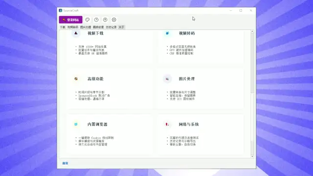

# SourceCraft / AI Video Lab

🔥 **一站式 AI 视频处理与超级下载神器**

欢迎来到 **SourceCraft** 官方介绍页！

### 🎥 实机演示预览 (Demo Preview)

> *注：上述为精简版功能预览动画。如果您希望观看完整的高清实机演示版本：*
> 👉 **[【点击此处观看/下载完整版 1080P 高清演示视频 (约 35MB)】](https://github.com/lihaolong8517/SourceCraft-/raw/main/assets/demo.mp4)**

## 📦 官方软件下载地址 / Official Download

👉 **[点击这里前往官方下载页面](https://hundunxiazaiqi.cn/)** 👈

👉 **[https://hundunxiazaiqi.cn/](https://hundunxiazaiqi.cn/)** 👈

---

## ✨ 核心功能亮点 (Feature Highlights)

SourceCraft 不仅仅是一个下载器，更是您无缝获取网络素材、进行 AI 智能画质修复与特效渲染的专业级多媒体工作站。

### 🚀 1. 全平台极速与超清提取 (Universal Video Downloader)
- **1000+ 平台支持**：底层基于深度定制与增强的提取引擎，轻松突破限制，支持国内外几乎所有主流视频、音频、社交平台。
- **极致无损原画解析**：智能探测该网络资源的最高画质，完美提取 4K/8K 视频原文件及无损音轨，支持分段流媒体自动解析拼接。
- **高速多线程引擎**：优化底层网络并发逻辑，自动拉满带宽，给您前所未有的畅快下载速度。

### 🤖 2. 旗舰级 AI 画质修复与增强 (AI Video Enhancement)
- **内置旗舰级 AI 引擎**：无缝集成行业顶级的 AI 图像处理模型（如 RealESRGAN），专注解决老旧视频、重度压缩低分辨率视频的画质痛点。
- **智能消除伪影与超分提质**：一键清除视频马赛克、涂抹感与压缩伪影，将 480P/720P 粗糙画质物理级超分、锐化提升至 4K 极清电影质感。
- **开箱即用免配置**：极其庞杂的 AI 运行库、Python 环境及 GPU 调用均已在打包时完成深度适配与隔离，用户无需敲任何代码，傻瓜式点击即可开启 AI 算力修复。

### 🌐 3. 独立化内置无痕沙盒浏览器 (Built-in Playwright Environment)
- **独家防隔离驱动**：自带独立的基于 Playwright 框架的浏览驱动，一键绕过普通脚本难以处理的复杂网页与反爬验证。
- **可视化安全扫码提取**：所见即所得的内挂浏览器界面，支持用户自主随时介入进行手工扫码、账密登录与保存授权 Cookies。完美提取那些需登录或处于“VIP/私密模式”的高墙视频库。

### 🎨 4. 高级图像工作流与格式直出 (Advanced Visual Effects)
- **特殊视觉特效生成**：不仅专注于视频业务，内附专为图像设计的高阶渲染处理流，支持对静态图片进行一键玻璃拟物化、立体光影调整等高级创意后期。
- **专业格式转换**：打通多媒体业务的最后一个环节，内置 ffmpeg 工业级标准无缝重新混流，将视频与图像直接导出为你所需要的各类终端兼容格式。

---

## 📌 声明与说明
- 本 GitHub 仓库仅用于引流介绍与最新功能说明 (Release Notes) 的发布。
- 软件安装套包因囊括全量本地化 AI 模型、本地加速组件及完整的独立浏览器驱动库，单包体积达到GB级别，无法托管于 GitHub，**请务必前往上方官方链接进行高速下载**。
- 有关授权码激活、商用购买或定制化技术支持，请直接在客户端内联络客服或查阅官方渠道。

---
*© 2026 SourceCraft 保留所有权利。*
